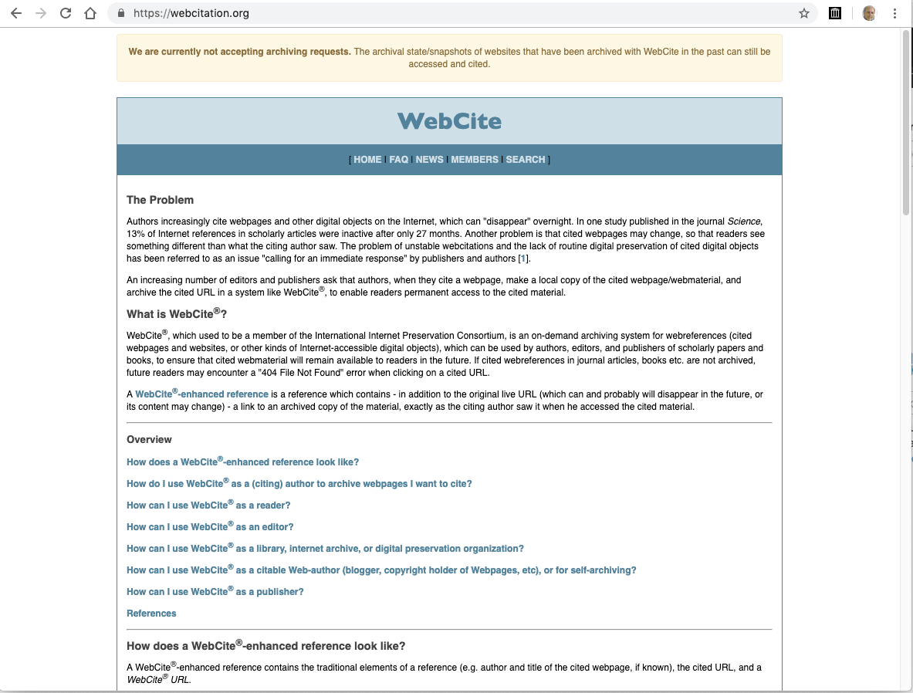
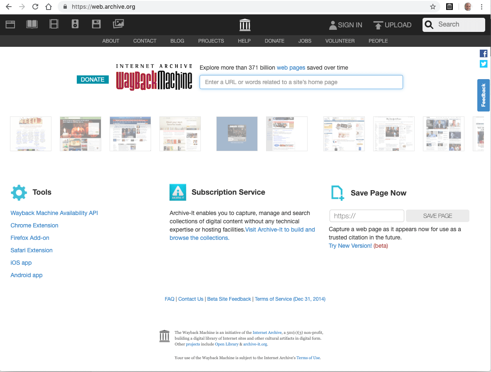

<figure class="border shadowed floatright">
  
  <figcaption>Image by <a href="https://pixabay.com/users/creativesignature-1460253/?utm_source=link-attribution&amp;utm_medium=referral&amp;utm_campaign=image&amp;utm_content=1633406">Chris Stermitz</a> from <a href="https://pixabay.com/?utm_source=link-attribution&amp;utm_medium=referral&amp;utm_campaign=image&amp;utm_content=1633406">Pixabay</a></figcaption>
</figure>

Quoting web resources is a hassle for several reasons:

1.  Web pages are not available anymore.
2.  Web pages have moved to another URL.
3.  Web pages change their content so that the cited reference is not correct anymore.

Humanities, where detailed content analysis of websites is a popular research method. Referring to exact quotes is a question of reproducibility and therefore crucial in science generally. This article presents some strategies and tools to bypass the challenges mentioned above.

## Quote websites with the Wayback Machine

With [WebCite](https://webcitation.org/), there used to be a web service to circumvent link rot and changed the content. WebCite [allowed to archive online resources](https://en.wikipedia.org/wiki/Wikipedia:Using_WebCite) and returned an URL where these filed pages could be accessed. Besides that this service was often down and therefore [notoriously unreliable](https://en.wikipedia.org/wiki/Talk%3AWebCite), as of July 14, 2019, it does not accept any new archive requests anymore.

<figure class="border shadowed">
  
  <figcaption><strong>Figure 1:</strong> Start page of the WebCite service, proclaiming that new archiving request are currently not feasible anymore.</figcaption>
</figure>

Luckily with [Wayback Machine](https://web.archive.org/save)[^1], operated by the [Internet Archive](https://en.wikipedia.org/wiki/Internet_Archive), there is recently a new and reliable web service available. Although there is a [sophisticated how-to use](https://en.wikipedia.org/wiki/Help:Using_the_Wayback_Machine) of this service in the Wikipedia context, I have prepared my own [How-to use Wayback Machine for the general public](/slide/wayback-machine-tutorial/).

Visit my tutorial on [How-to use Wayback Machine for the general public](/slide/wayback-machine-tutorial/).

 <figcaption><h4>**Figure 2:** Start page of the Wayback Machine, a service by the Internet Archive</h4></figcaption>

## How to cite archived resources?

Internet Archive asked the Modern Language Association (MLA) how to cite resources archived with the Wayback Machine. MLA Style is a prevalent system for documenting sources in scholarly writing.

MLA answered

> that there is no established format for resources like the Wayback Machine, but it's best to err on the side of more information. You should cite the webpage as you would normally, and then give the Wayback Machine information.

MLA also provided an example:

> McDonald, R. C. "Basic Canary Care." *Robirda Online*. 12 Sept. 2004. 18 Dec. 2006 \[<http://www.robirda.com/cancare.html>\]. *Internet Archive*. \[ <http://web.archive.org/web/20041009202820/http://www.robirda.com/cancare.html>\].

Note there are several additions to a standard bibliography:

-   **Two dates:** The first is the date of the archive, then comes the date when the page is retrieved.
-   **Two URLs:** The first is the original URL (not available anymore), then comes the archived URL from the Internet Archive.
-   **Web service:** Between the two URLs comes the 'second' author, the name of the internet service which archived the resource and generated its URL.

According to MLA, both URLs shouldn't be underlined in the bibliography.

Let's try another example. The archiving service [Peeep.Us](http://peeep.us) is not available anymore. The Wayback Machine gives us as archived URL <https://web.archive.org/web/20180813205348/http://peeep.us:80/>. If we are are going to compose this bibliography in the usual way, we would get:

> Nikolaev, Cyril. "Peeep.Us." Save Snapshot of a Web Page Forever!, 13 Aug. 2018, <https://web.archive.org/web/20180813205348/http://peeep.us:80/>.

Using a name for web sites may questionable, but I use it whenever there is a reasonable possibility (e.g., from the Copyright or from the name of the institution, which produces the web site).

Now we have to add the retrieval date, the original URL and the name of the archiving service:

> Nikolaev, Cyril. "Peeep.Us." *Save Snapshot of a Web Page Forever!*, 13 Aug. 2018, 22 Jul. 2019 \[<http://peeep.us>\]. *Internet Archive*. \[<https://web.archive.org/web/20180813205348/http://peeep.us:80/>\].

## Wakelet

In addition to the following [Wakelet](https://wakelet.com/), there is also a [community edition on my Wakelet homepage](https://wakelet.com/@PeterBaumgartner) where you can add relevant links.

<iframe class="wakeletEmbed" width="100%" height="760px" src="https://embed.wakelet.com/wakes/ab838261-17e2-4603-b3c8-dc666064fe16/list" style="border: none" allow="autoplay">

</iframe>

<!-- Please only call https://embed-assets.wakelet.com/wakelet-embed.js once per page -->

[^1]: To access this page you must be registered by [archive.org](https://archive.org/).
