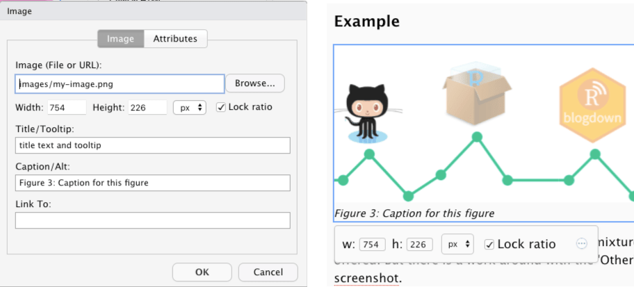

## Introduction

This article is the first of a series of posts to investigate methods of inserting figures into different markdown formats. The resulting code depends on how images are included and the conversion tool they have to undergo. And --- at least I think --- also somewhat on the theme in use. In my case it is the blog widget of the `starter-academic` theme.

Here I look at the process chain from Rmd via [Pandoc](https://pandoc.org/) to HTML. I will inspect inserting images with the following methods:

-   R chunk code via `knitr::include_graphics()`.
-   'Insert Image' window via blogdown Addins
-   'Image ...' window vial Visual R Markdown
-   Hugo shortcode

Of course, you can always include HTML instead of markdown code, but this case is not of interest here as there are no changes during the conversion process.

## Using r chunk with `knitr`

You can include external images with the [knitr function `include_graphics()`](https://www.rdocumentation.org/packages/knitr/versions/1.33/topics/include_graphics). There are [many chunk options](https://yihui.org/knitr/options/#plots) to specify the resulting figure, but not all are useful for external images.

-   Use `out.width` and `out.height` (not `fig.width` or `fig.height`, they are for R-generated plots)
-   Use `out.extra` to add CSS styles (see for details [Style your image environment with CSS](http://zevross.com/blog/2017/06/19/tips-and-tricks-for-working-with-images-and-figures-in-r-markdown-documents/#style-your-image-environment-with-css))
-   If `fig.cap` is provided without `fig.alt`, it will also function as alternative text, which is usually not desired.
-   Use [output hooks](https://bookdown.org/yihui/rmarkdown-cookbook/output-hooks.html) if you want even more control.

### Example

```{r img-with-knitr, echo=FALSE, fig.align='center', out.width='100%', fig.cap='Caption for figure 1', fig.alt='Alternative text for figure 1'}
knitr::include_graphics("images/my-image.png")
```

### Code in R Chunk

    ```
    {r img-with-knitr, echo=FALSE, fig.align='center', out.width='100%', fig.cap='Caption for figure 1', fig.alt='Alternative text for figure 1'}
    knitr::include_graphics("images/my-image.png")
    ```

### Code in HTML

    ```
    <div class="figure" style="text-align: center"><span id="fig:img-with-knitr"></span>
        
        <p class="caption">
            Figure 1: Caption for figure 1
        </p>
    </div>
    ```

It is a stand-alone feature of `knitr` to provide automatically generated figure numbers that you can reference via their id. The id is generated from the chunk name with the pattern `fig:<chunk name>`. The figure 1 above can be referenced with `\@ref(fig:img-with-knitr)`. Like this:

> For more details see Figure \@ref(fig:img-with-knitr).

{} But in that case, you cannot use other methods to insert figures with numbers as `knitr` will not be aware of them. {}

The relevant selectors for CSS styles are `div.figure` and `p.caption`. We will see that these styles are consistent with all the other methods provided by RStudio windows. But Hugo's figure shortcode uses the HTML tags `figure` and `figcaption`. In the [R Markdown Coobook](https://bookdown.org/yihui/rmarkdown-cookbook/hook-html5.html) is a work around expained how you can produce these Hugo HTML tags with `knitr`.

### CSS {#css}

The CSS style I have used to display the image:

    div.figure {
            border: 1px;
            border-style: groove;
            box-shadow: 0 4px 8px 0 rgba(0, 0, 0, 0.2), 0 6px 20px  rgba(0, 0, 0, 0.19);
    }

    p.caption {
        text-align: center;
        margin-top: -0.5rem;
        margin-bottom: 0.5rem;
        font-size: smaller;
    }

### Summary

Using the `knitr` function `include_graphics()` for external images provides a rich set of image attributes (tags). It is also very flexible, especially if you are using the more complex possibilities like programming the output chunk hook.

-   **Caption**: yes
-   **Format of caption**: no
-   **Caption automatically numbered**: yes
-   **Alt**: yes
-   **Title**: no
-   **Tooltip**: no
-   **Width/Height**: yes
-   **Link to**: no
-   **ID**: yes (format: "fig:\<chunk name\>)
-   **Classes**: yes (with `out.extra`, example: `out.extra='class="border shadowed"'`
-   **CSS style**: yes (with out.extra, example: `out.extra='style="background-color: #9ecff7; padding:10px; display: inline-block;"'` See blog post [Tips and tricks for working with images and figures in R Markdown documents](http://zevross.com/blog/2017/06/19/tips-and-tricks-for-working-with-images-and-figures-in-r-markdown-documents/)
-   **Other** (key=value): no

## Markdown via Addins 'Insert Image' {#markdown-via-addins-insert-image}


The possibilities of RStudio Addins window for `blogdown` are sparse. But it has one big advantage: The addin helps user to provide the correct file path and copies the image to the right place.

The RStudio Addins window for `blogdown` package allows only width / height arguments and alternative text. The content of the 'alt'-attribute is in the final HTML code converted to the caption, [which is not correct](https://blog.spotibo.com/difference-between-alt-text-and-title-text/):

The alternate text should describe what you can see on the image in case the image does not appear (e.g., is blocked) or the user applies a screen reader. 'Alt' text is also rendered by search engines. Every picture should have a corresponding 'alt' attribute The caption by contrast is not so important. It provides additional information and appears under the image explaining the content to reader who are able to see the picture.

### Example

{width="100%"}

{} You can't use the Addins 'Insert Image' in Visual R Markdown mode because it protects the conversion by adding a backslash in front of the squared brackets: `!\[Alt text\](images/my-image.png)`.{}

### Code in markdown

RStudio Addins window produces the following markdown code:

    {width=100%}

I think starting with the RStudio version 1.4 (January 2021) the RStudio Addin window is superseded by the the [Visual R Markdown](https://rstudio.github.io/visual-markdown-editing/#/) window (see [next section](#visual-r-markdown-via-menu-insert)). If you are turning on the visual editor you can always enhance the rudimentary markdown of the addin window with all the features of Visual R Markdown.

For this improvement you need to

-   turn on Visual RStudio Markdown;
-   select the image which markdown you want to enhance;
-   click into the small round button with the three points to open up the dialog window;
-   correct or add the desired content for the attributes (there is more under the "Attributes" tab);
-   close the window;

If you want to work with markdown directly you may turn off Visual RStudio Markdown.


### Code in HTML

Here I am referring to the RStudio Addin without enhancement from the Visual R Markdown window.

    <div class="figure">
        
        <p class="caption"><strong>Figure 2:</strong> Caption for this figure 1           
        </p>
    </div>

As you can see: The `alt` attribute is empty, although I have filled it out!

{} If you do not provide text for the `alt` (= capture) attributes then there is no `div.figure` and `p.caption` class. In this case there is only the `img` tag as you can see with the image under the header [Markdown via Addins 'Insert Image'](#markdown-via-addins-insert-image). {}

### CSS {#css-1}

The conversion to HTML produced exactly the same classes as in the result with the `knitr` image inclusion (see the [CSS code under the knitr section](#css)).

### Summary

-   **Caption**: yes
-   **Format of caption**: yes
-   **Caption automatically numbered**: no
-   **Alt**: no
-   **Title**: no
-   **Tooltip**: no
-   **Width/Height**: yes
-   **Link to**: no
-   **ID**: no
-   **Classes**: no
-   **CSS style**: no
-   **Other** (key=value): no

## Visual R Markdown via Menu 'Insert ...'


After you have turned on Visual R Markdown you can load the image window via the Menu `'Insert ' -> 'Image…'` or shortcut `r knitr::asis_output("\U21e7\U2318I")`. For an overview I put in the picture above both parts of the window side by side. You can see that it offers a very complete list of image attributes.

{} If you do not include text in the "Caption/Alt" field then no HTML code for the `div.figure` and `p.caption` classes will be produced and the appropriate CSS styles cannot be applied.{}

### Example

{#figure3 alt="here comes a description for blind people, screen readers and search engines"}

Even in this enhanced window is the wrong mixture of 'Caption' and 'Alt' attributes offered. But there is a work around with the 'Other'-field as I have shown in the screenshot.

{} Fill in the field "Caption/Alt" **and** add the `alt` attribute in the field "Others". After the conversion to HTML the former constitutes the caption and the later the alternative text. {}

If you click on the inserted image and call the window again, then a slightly different window appears where fields for width and height are added and can be changed. This addition appears under the image as well by just clicking on the image.

{#width-height-added alt="Width and height field added after the image was included into the .Rmd page. Left: changed window, right: after click into the inserted window."}

### Code in markdown

    {#figure3 alt="here comes a description for blind people, screen readers and search engines}

In addition to the standard markdown code all the other attributes are added inside curly brackets.

### Code in HTML

    <div class="figure">
        
        <p class="caption">
            Figure 3: Caption for this figure
        </p>
    </div>

### CSS

The conversion to HTML produced exactly the same classes as in the result with the other two methods [`knitr` image inclusion](#css) and [Addins 'Insert Image'](#css-1)).

### Summary

-   **Caption**: yes
-   **Format of caption**: no
-   **Caption automatically numbered**: no
-   **Alt**: no
-   **Title**: yes
-   **Tooltip**: yes
-   **Width/Height**: yes
-   **Link to**: yes
-   **ID**: yes
-   **Classes**: yes
-   **CSS style**: yes
-   **Other** (key=value): yes

## Hugo figure shortcut

> You cannot simply write  in R Markdown, because Pandoc is not aware of Hugo shortcodes, and may convert special characters so that Hugo can no longer recognize the shortcodes (e.g. \< will be converted to \<).[^1]

With [Blackfriday](https://gohugo.io/getting-started/configuration-markup/#blackfriday) as default Markdown rendering engine I used to use for shortcodes the `blogdown::shortcode()` function. But after Hugo v0.60 the default Markdown rendering engine changed to [Goldmark](https://gohugo.io/getting-started/configuration-markup/#goldmark). In the above quoted man page for the shortcode() function there is a also special note on this issue:

> Since Hugo v0.60, Hugo has switched its default Markdown rendering engine to Goldmark. One consequence is that shortcodes may fail to render. You may enable the unsafe option in the configuration file: <https://gohugo.io/getting-started/configuration-markup/#goldmark>.

I couldn't understand this remark as for me all the Hugo shortcodes works well. But to apply it more easily I use pure HTML code chunks to prevent a conversion by Pandoc. This has the advantage that I can include Hugo's shortcode syntax without any changes.

### Example

```{=html}

```
### Code in HTML chunk

    ```{=html}
    
    ```

The `id` and `numbered` attributes are not provided by but they are a [feature from the academic theme](https://wowchemy.com/docs/content/writing-markdown-latex/#single-image).

-   If you do not use `id` explicitly then Hugo generates an ID with the "figure-" followed by the caption text (e.g., `id="figure-my-caption-text"`).
-   You can see that the numbering systems starts from scratch, e.g., it does not account for the `knitr` chunks. The same is true vice versa.
-   Besides the already mentioned attributes Hugo also features `target`, `rel` and attribution (`attr` = text; `attrlink` = link).

### CSS

    ```{=html}
    <figure id="figure-shortcut-figure">
      <div class="d-flex justify-content-center">
        <div class="w-100">
            </div>
      </div>
      <figcaption data-pre="Figure&nbsp;" data-post=":&nbsp;" class="numbered">
          My caption text
      </figcaption>
    </figure>

    ```

The produced HTML is pretty complex, but here we are just interested in the two relevant tags for CSS styling: `<figure>` and `<figcaption>`. These two HTML tag are different to the code produced by other methods of inserting images. So maybe it would be a good idea to style both variants the same way.

### Summary

-   **Caption**: yes
-   **Format of caption**: no
-   **Caption automatically numbered**: yes (Academic theme)
-   **Alt**: yes
-   **Title**: no
-   **Tooltip**: no (zoomable)
-   **Width/Height**: yes
-   **Link to**: yes
-   **ID**: yes (Academic theme)
-   **Classes**: yes
-   **CSS style**: yes
-   **Other** (key=value): no

## Results and Conclusion

+--------------+-------+-------+--------+-------+-------------------------------------------------+
| Attribute    | knitr | Addin | Visual | Hugo  | Remark                                          |
+==============+:=====:+:=====:+:======:+:=====:+=================================================+
| Caption      | ✅     | ✅     | ✅      | ✅     |                                                 |
+--------------+-------+-------+--------+-------+-------------------------------------------------+
| C. format    | ❌ ^2^ | ✅     | ❌      | ❌ ^2^ | ^2^ standard = bold                             |
+--------------+-------+-------+--------+-------+-------------------------------------------------+
| C.numbered   | ✅     | ❌     | ❌      | ✅ ^3^ | ^3^ via 'Academic' theme                        |
+--------------+-------+-------+--------+-------+-------------------------------------------------+
| Alt          | ✅     | ❌     | ✅ ^4^  | ✅     | ^4^ via 'Other'-field                           |
+--------------+-------+-------+--------+-------+-------------------------------------------------+
| Title        | ❌     | ❌     | ✅      | ❌     |                                                 |
+--------------+-------+-------+--------+-------+-------------------------------------------------+
| Tooltip      | ❌     | ❌     | ✅      | ❌     |                                                 |
+--------------+-------+-------+--------+-------+-------------------------------------------------+
| Width/Height | ✅     | ✅     | ✅      | ✅     |                                                 |
+--------------+-------+-------+--------+-------+-------------------------------------------------+
| Link to      | ❌     | ❌     | ✅      | ✅     |                                                 |
+--------------+-------+-------+--------+-------+-------------------------------------------------+
| ID           | ✅ ^5^ | ❌     | ✅      | ✅ ^6^ | ^5^ `fig:<chunk name>`                          |
|              |       |       |        |       |                                                 |
|              |       |       |        |       | ^6^ `figure-<caption text>` or 'Academic' theme |
+--------------+-------+-------+--------+-------+-------------------------------------------------+
| CSS          | ✅     | ❌     | ✅      | ✅     |                                                 |
+--------------+-------+-------+--------+-------+-------------------------------------------------+
| Other        | ❌^1^  | ❌     | ✅ ^7^  | ✅ ^8^ | ^1^via output chunk arbitrary HTML code!        |
|              |       |       |        |       |                                                 |
|              |       |       |        |       | ^7^ free choice!                                |
|              |       |       |        |       |                                                 |
|              |       |       |        |       | ^8^ `target`, `rel`, `attr`, `attrlink`         |
+--------------+-------+-------+--------+-------+-------------------------------------------------+

: Table: Features of different method of inserting images in Rmd files converting to HTML

If we take into account that code produced by the RStudio Addin window can be improved at any time with the Visual R Markdown window then all the four offered methods are pretty similar. But keep in mind that advantages on the one hand are often counter acted by disadvantages on other areas. So --- for instance --- provides the conversion via Pandoc many advantages but looses also some features of Hugo or the applied theme.

To sum up this this little investigation I see three patterns of decisions criteria:

-   One big difference is the possibility to number the figures automatically. The Addin and Visual R Markdown windows do not provide this feature.
-   On the other hand filling in the window fields is --- especially for people who are not so comfortable with HTML or Markdown code --- easier.
-   Another decision criteria could be consistency: If you are using R chunks (which is the major reason to use the .Rmd format!) and want to be consistent throughout the file, then the decision for the `knitr` method is obvious.

But let's see what the other file format are producing. For people using different methods[^2] for their posts perhaps the comparison inside one file format is not sufficient. Perhaps there is a method not ideal when considered only one file format but has a higher consistency when looked all file format together.

[^1]: Helper functions to write Hugo shortcodes using the R syntax

[^2]: As with blogdown version 1.3 not all files are automatically rendered, one could choose a different file and conversion format for every post separately. This requires (1) deleting those files produced by the conversion process in the folder of the post under consideration (2) renaming the file ending of the main file and kniting/rendering the new file format again.
